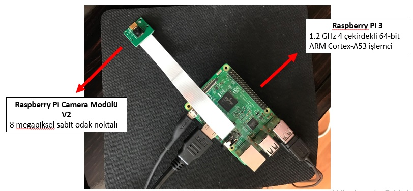

# Number Plate Recognition using OpenALPR and Saving to Google Spreadsheet (Raspberry Pi)

  This project using Raspberry Pi, reading the license plates with the OpenALPR library, converting them to characters and saving the data to google spreadsheet.


## **Hardware**
-Rasberry Pi 3B <br/>
-SD Card <br/>
-Raspberry Pi Camera <br/>
-HDMI Cable <br/>

## **Python Libraries**
```
-cv2 
-datetime
-requests
-gspread
-oauth2client.service_account
```
## **Setup**
1. Create an account in [openalpr](https://cloud.openalpr.com/) and copy the secret key from the OpenALPR CloudApi section.
2. Add the secret key and change the country code in test.py.
3. Create your document in Google Drive for records. [(steps to be taken..)](Plate_Recognition.pptx)
## **Run**
Open Raspberry Pi Terminal <br/>
`test.py`
